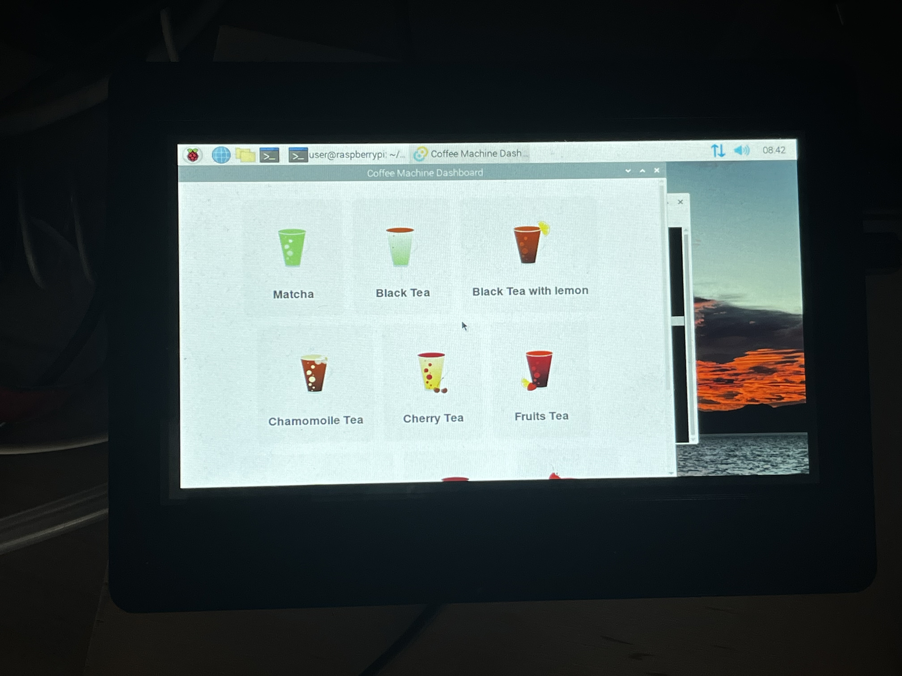

# teaMachineVueDashboard

This repository contains software for tea machine, tailored to run on Raspberry PI 2. It is a hybrid project combining web development and Rust-based desktop application development. It includes Vue 3, TypeScript, and Vite for building the frontend while leveraging Tauri for creating lightweight, secure desktop applications. The Rust-based backend setup is managed with Cargo, and TypeScript configurations optimize the development experience. Package management for JavaScript dependencies is handled with Yarn. It was cross complied for armv7 architecture and run on Raspberry PI 2.

